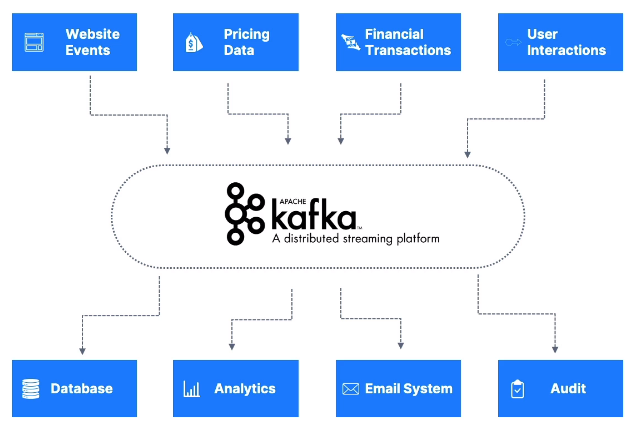
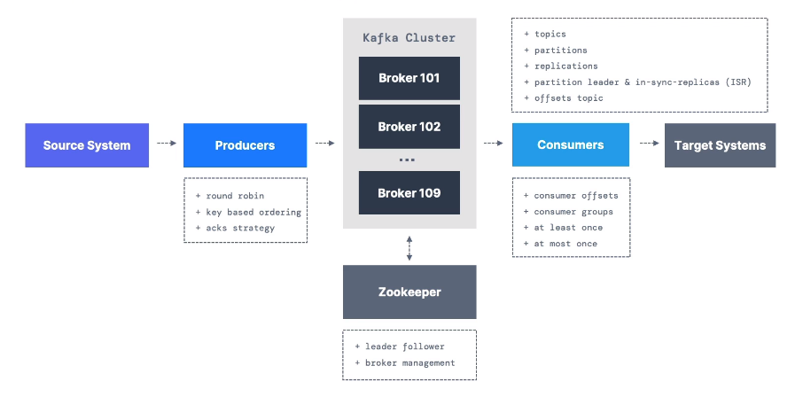
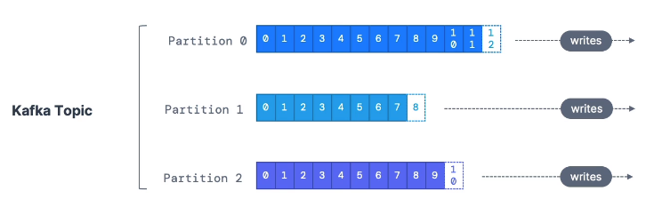
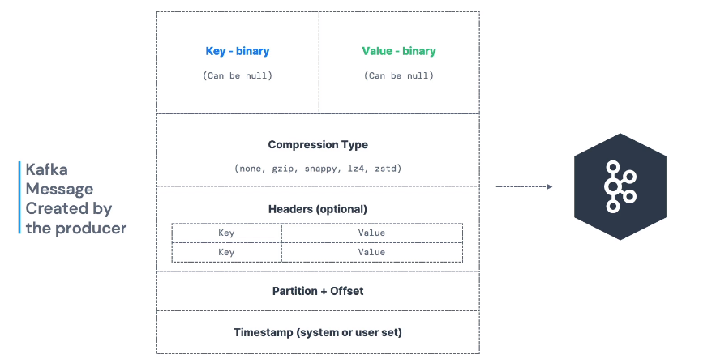
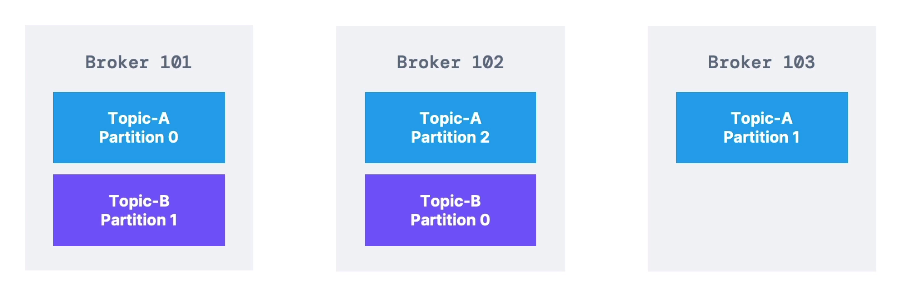
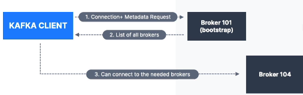

# Introduction

- [Introduction](#introduction)
- [What is Apache Kafka?](#what-is-apache-kafka)
  - [History](#history)
  - [Use Cases](#use-cases)
  - [Concrete Cases:](#concrete-cases)
- [Kafka Overview](#kafka-overview)
  - [Kafka Topics](#kafka-topics)
  - [Partitions](#partitions)
  - [Example](#example)
- [Producers](#producers)
  - [Message Serializer](#message-serializer)
  - [Kafka Partitioner](#kafka-partitioner)
- [Consumers](#consumers)
  - [Consumer Deserializer](#consumer-deserializer)
- [Consumer Groups](#consumer-groups)
  - [Consumer Offsets](#consumer-offsets)
  - [Delivery Semantics](#delivery-semantics)
- [Brokers](#brokers)
  - [Kafka Broker Discovery](#kafka-broker-discovery)
- [Topic Replication Factor](#topic-replication-factor)
  - [Leaders for a partition](#leaders-for-a-partition)
  - [Kafka Consumer Replica Fetching (V2.4+)](#kafka-consumer-replica-fetching-v24)
  - [Producer Acknowledgement (Acks)](#producer-acknowledgement-acks)
  - [Kafka Topic Durability](#kafka-topic-durability)
- [Zookeeper](#zookeeper)
  - [Design](#design)
  - [Future:](#future)
  - [KRaft](#kraft)


# What is Apache Kafka?
Solves the problem of connecting multiple data transfer from multiple sources to multiple target systems. Kafka sits in the middle handling the different data streams.

Source systems will be responsible for sending data to Kafka.
Target systems will recieve / 'tap into' Kafka.



## History
Created by LinkedIn, now Open Source.
Maintained by Confluent, IBM, Cloudera
Distributed, resilient architecture, fault tolerant - maintainence during operation
Horizontal Scalability - 
* Add brokers to clusters
* Scale for large data streams
Real time - High-performance, low latency (10ms)

Used by 2000+ firms, 80% of Fortune 100
* LinkedIn
* Airbnb
* Netflix
* Uber
* Walmart

## Use Cases
* Messaging System
* Activity Tracker
* Gather Metrics from Different Locations
* Application Logs Gathering
* Stream Processing (with Kafka Streams API)
* De-coupling of system dependencies
* Big data integration (i.e. Hadoop)
* Microservices pub/sub system

## Concrete Cases:
* Netflix - apply show recommendations in real-time
* Uber - gather user, taxi & trip data in real-time to compute and forecast demand - allows surge pricing
* LinkedIn - prevent spam, collect user interactions to make better connections in realtime

Kafka is the underlying transportation mechanism.

# Kafka Overview



## Kafka Topics
A particular stream of data. These could be:
* Logs
* Purchases
* Twitter_tweets
* etc

Like a table in a database (without constraints - no data verification)

A data cluster can include many topics and are identified by name. Topics are supported by any message format (JSON, txt, binary, etc)

A sequence of messages is called a data stream.

Topics cannot be queried, instead they are published (sent) using Kafka producers and are consumed (read) using Kafka consumers.

## Partitions



* Topics are typically split in partitions
* Messages within each partition are ordered.
* Each message within a partition gets an incremental ID called an offset. Offsets are only relevant to the corresponding partition. Offsets are not used, even after deletion. This allows ordering within a partition but not cross-partition



* Kafka topics are immutable - once data is written to a partition, it cannot be changed
* Data is kept for a limited time - configurable
* Data is assigned randomly to a partition if a key is not provided

## Example
* You have a fleet of taxis, each taxi reports its GPS to Apache Kafka
* Each taxi reports its message every minute to Kafka, sending a message containing the taxi Id, latitude and longitude.
* We will have a topic called taxi_gps that contains the positions over time of all taxis
* We will choose to create 20 partitions for this particular topic.
* We will create a location dashboard and a notification service as a consumer.

# Producers
Producers write to the partitions within the Kafka topics.
* Producers know which partition and broker to write to - decided in advance
* In case of broker failures, producers know how to recover
* Can perform load balancing to different partitions
* Producers can send an optional key with a message (number, string)
  * If keys are null, they are sent round-robin (distributed)
  * if keys are not null, they can go to a specific partition (hashing)
  * Keys are typically sent for message ordering for a specific field

SCREENSHOT

## Message Serializer
Kafka only accepts input bytes from producers and outputs bytes to consumers - Kafka Message Serializer helps converts objects into corresponding bytes.
    * Used on the key-value pairs in the message headers
    * Come in Common Serializers (String incl. JSON, int, float, avro, protobuf)

## Kafka Partitioner
Code logic that takes a record and determines which partition to send it to.
* Key Hashing is process of determining mapping of a key to partition
* Default key hashing uses murmur2 algorithm

# Consumers
Read data from Kafka by name - it is a pull model
* Consumers can read and pull from one or more partitions
* Automatically know which broker to read from
* In cases of broker failures, know how to recover
* Data is read from low to high offset within each partition

## Consumer Deserializer
Indicates how to deserialize bytes into constituent objects, and are used on the value and key of the message
* Will have to know the format of the message beforehand

Common Deserializers:
* String (incl JSON)
* Int, floats
* Avro
* Protobuf

Serialization and Deserializaion type should not occur for a topic lifecycle - a new topic should be started instead.

# Consumer Groups
All the consumers in an application read data as consumer groups - each consumer within a group reads data from exclusive partitions.
* If consumers > partitions, some consumers will be inactive
* Acceptable to have multiple **consumer groups** on a single topic.

## Consumer Offsets
* Kafka stores the offsets at which a consumer group has been reading
* Offsets are in a Kafka topic named __consumer_offsets
* When a consumer in a group has processed reading data from Kafka, it will periodically commit the offset (done indirectly via Kafka rather than the broker)
* This allows Consumers to continue reading data from a certain point of the partition. Also allows to continue reading after a consumer dies.

## Delivery Semantics
By default, Java consumers will automatically commit offsets (at least once)
There are three delivery semantics for manual commits:
1) At least once (usually preferred)
    * Offsets committed once message is processed
    * If processing goes wrong, message will be read again
    * This can result in duplicate messaging - hence processing should be idempotent (processing the messages again won't impact the system)
2) At most once 
    * Offsets are committed as soon as messages are recieved
    * If processing goes wrong, message will be lost as they won't be read again
3) Exactly once
    * Kafka Workflows: Use transactional and Kafka Streams API
    * External System: Use an idempotent consumer

# Brokers



Essentially a 'server' in Kafka
* A Kafka cluster is composed of multiple brokers
* Each broker is identified with its ID (integer)
* Each broker contains certain topic partitions
* After connecting to any broker (called a bootstrap broker), you will be connected to an entire broker (Kafka clients have smart mechanics)
* Typical clusters have 3 brokers, but some have over 100
* Data and Partition can be distributed over multiple brokers

## Kafka Broker Discovery



Every Kafka broker is also a bootstrap broker
* This means you only need to connect with one broker and the Kafka clients will know how to be connected to the entire cluster (**smart clients**)
* Each broker knows about all other brokers, along with its topic and partitions (**metadata**)


# Topic Replication Factor
* Topics should have a replication factor or 2 or 3.
* If a broker is down, a broker can still serve data.

## Leaders for a partition
* At a given time, only one broker can be a leader for a given partition
* Producers can only send data to the broker that is the leader of that partition
* Other brokers will replicate the data
* Each partition has one leader and many in-sync replicas
* By default, producers will only write to the leader broker and consumers will only read from the leader broker for a particular partition

## Kafka Consumer Replica Fetching (V2.4+)
Has changed over time, and different systems may use different versions.
* Possible to configure consumers to read from the closest replica - reduces latency and cloud cost
  
## Producer Acknowledgement (Acks)
Producers can choose to recieve confirmation of data writes.
* ```acks = 0```: Producer won't wait for acknowledgement - possible data loss 
* ```acks = 1 ```: Producer will wait for leader acknowledgement - limited data loss
* ```acks = all```: Producer will wait for Leader and ISR acknowledgements - no data loss

## Kafka Topic Durability
* For a topic replication of 3, topic data durability can withstand 2-broker loss.
* For a replication factor of N, the topic can withstand up to N-1 broker losses and still recover data.

# Zookeeper
* Zookeeper manages brokers through a list
* Zookeeper helps in leader elections for partitions
* Zookeeper sends notifications to Kafka in case of changes (new topic, broker death, broker revives, delete topics, etc)
* Kafka 2.X cannot work without Zookeeper
* Kafka 3.X works without it, using Kafka Raft (KRaft -> KIP 500)
* Kafka 4.X will not have zookeeper

## Design
* Operates with an odd number of servers (1,3,5,7)
* Zookeeper has a leader (writes) and followers (reads)
* Does not store consumer offsets with Kafka >0.10

## Future:
* For brokers - we should still use Zookepeer as Kafka 4.0 is not production ready
* For clients - over time Kafka clients and CLI have migrated to use brokers as a connection endpoint instead of Zookeeper
* Since Kafka 0.10, consumer offset is stored in Kafka and must not be stored in Zookeeper as it is deprecated
* Since Kafka 2.2, ```kafka-topics.sh``` references Kafka brokers and not Zookeeper for topic management.
* All previous commands that utilised Zookeeper are migrated to use Kafka instead to provide a seamless transition in Kafka 4.0
* Zookeeper is less secure than Kafka - ports should be opened to allow traffic from Kafka brokers and not clients.
* Zookeeper has scaling issues for > 100,000 partitions. 

## KRaft
* Can scale to millions of partitions, easier to maintain and setup
* Improves stability, monitoring, supporting and administering
* Single security model for whole system
* Single process to start with Kafka
* Faster controller shutdown and recovery time
* Kafka 3.X implements Raft Protocol in order to replace Zookeeper


