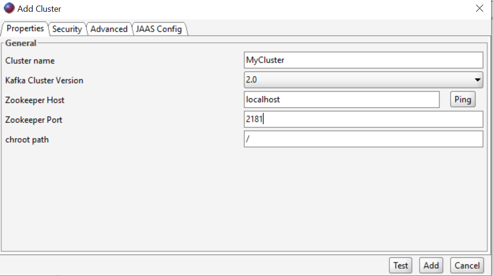
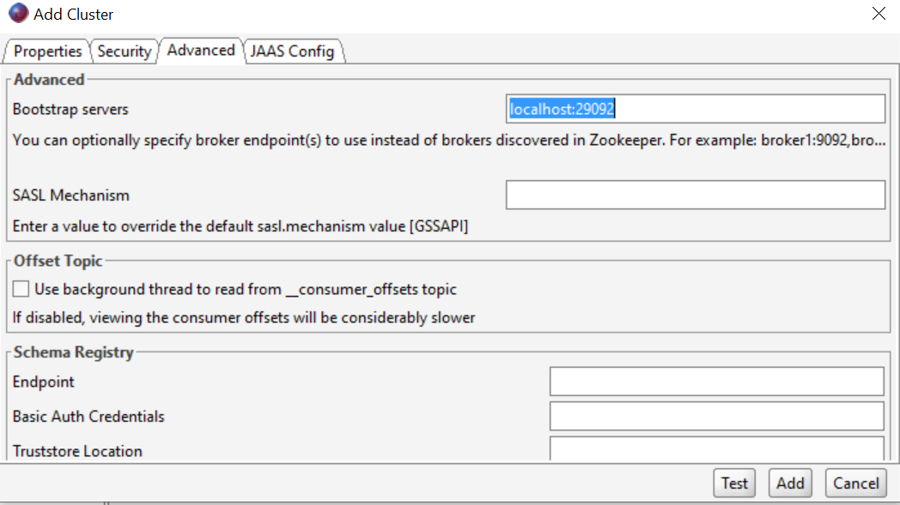
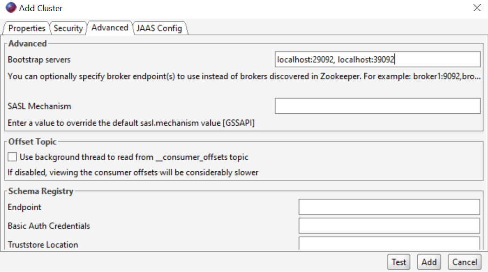
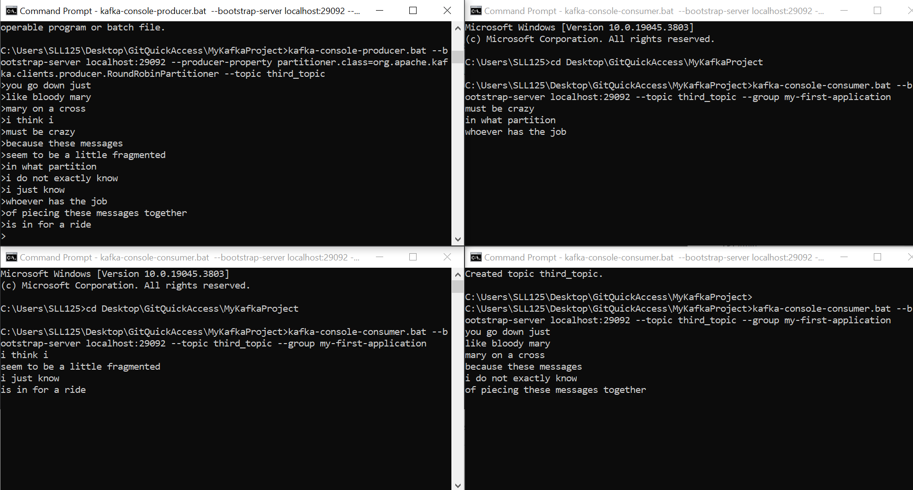

- [Prerequisites](#prerequisites)
- [Setting up Single Node Kafka and Zookeeper](#setting-up-single-node-kafka-and-zookeeper)
  - [YAML Configuration](#yaml-configuration)
  - [Docker compose command](#docker-compose-command)
  - [Offset Explorer 2](#offset-explorer-2)
  - [Stopping the containers](#stopping-the-containers)
  - [Setting up Multi Node Kafka and Zookeeper](#setting-up-multi-node-kafka-and-zookeeper)
  - [YAML Configuration](#yaml-configuration-1)
  - [Offset Explorer 2](#offset-explorer-2-1)
- [Executing Kafka Commands](#executing-kafka-commands)
- [Kafka Topic Management](#kafka-topic-management)
  - [Create](#create)
  - [Replication Factor](#replication-factor)
  - [List Topics](#list-topics)
  - [Describe Topics](#describe-topics)
  - [Delete Topics](#delete-topics)
- [Producers](#producers)
  - [Creating Message](#creating-message)
  - [Setting Properties](#setting-properties)
  - [Writing to an empty topic](#writing-to-an-empty-topic)
  - [Producing using keys](#producing-using-keys)
  - [Producing round-robin style (testing purposes)](#producing-round-robin-style-testing-purposes)
- [Consumers](#consumers)
  - [Displaying Data](#displaying-data)
  - [Detailed Data Display](#detailed-data-display)
- [Consumer in Groups](#consumer-in-groups)
  - [Creating a consumer group](#creating-a-consumer-group)
  - [New Consumer Groups](#new-consumer-groups)
  - [List Consumer Groups](#list-consumer-groups)
  - [Describe Consumer Groups](#describe-consumer-groups)
  - [Temporary Consumer Groups](#temporary-consumer-groups)
  - [Resetting Consumer Group Offsets](#resetting-consumer-group-offsets)


For this tutorial, we will have Docker installed. We can interact with the Docker through windows CMD.

# Prerequisites
The following example will be performed in Windows 10. We will also need to install:
* Docker Desktop
* Offset Explorer 2

# Setting up Single Node Kafka and Zookeeper

We will use Docker Compose and Yaml files to specify the architecture of our Kafka system (number of Zookeeper and Kafka Nodes). We will specifically be following this tutorial:

https://www.baeldung.com/ops/kafka-docker-setup

## YAML Configuration
The following YAML file specifies an architecture of one Zookeeper and one Kafka node.
```
version: '2'
services:
  zookeeper:
    image: confluentinc/cp-zookeeper:latest
    environment:
      ZOOKEEPER_CLIENT_PORT: 2181
      ZOOKEEPER_TICK_TIME: 2000
    ports:
      - 22181:2181
  
  kafka:
    image: confluentinc/cp-kafka:latest
    depends_on:
      - zookeeper
    ports:
      - 29092:29092
    environment:
      KAFKA_BROKER_ID: 1
      KAFKA_ZOOKEEPER_CONNECT: zookeeper:2181
      KAFKA_ADVERTISED_LISTENERS: PLAINTEXT://kafka:9092,PLAINTEXT_HOST://localhost:29092
      KAFKA_LISTENER_SECURITY_PROTOCOL_MAP: PLAINTEXT:PLAINTEXT,PLAINTEXT_HOST:PLAINTEXT
      KAFKA_INTER_BROKER_LISTENER_NAME: PLAINTEXT
      KAFKA_OFFSETS_TOPIC_REPLICATION_FACTOR: 1
```

## Docker compose command
Once we have saved the file in an appropriate location, we will go into the directory with cmd and run the following command to start up our nodes.

``docker-compose -f single-zook-single-kafka.yml up -d``
where the string specifies the name of the file.

## Offset Explorer 2
We can then view this using Offset Explorer 2 with the following configurations.




After clicking the test connection to verify the connection, we can then add this new connection to our left pane.

## Stopping the containers
The containers can then be stopped via the Docker Desktop interface or through the commands
```
docker ps -a
docker stop <container-id>
```

## Setting up Multi Node Kafka and Zookeeper

We will now specify a YAML file for a double Zookeeper, double Kafka architecture.

## YAML Configuration
We must ensure that the service names and KAFKA_BROKER_ID are unique across the services.

Moreover, each service must expose a unique port to the host machine. Although zookeeper-1 and zookeeper-2 are listening on port 2181, they’re exposing it to the host via ports 22181 and 32181, respectively. The same logic applies for the kafka-1 and kafka-2 services, where they’ll be listening on ports 29092 and 39092, respectively.

```
version: '2'
services:
  zookeeper-1:
    image: confluentinc/cp-zookeeper:latest
    environment:
      ZOOKEEPER_CLIENT_PORT: 2181
      ZOOKEEPER_TICK_TIME: 2000
    ports:
      - 22181:2181

  zookeeper-2:
    image: confluentinc/cp-zookeeper:latest
    environment:
      ZOOKEEPER_CLIENT_PORT: 2181
      ZOOKEEPER_TICK_TIME: 2000
    ports:
      - 32181:2181
  
  kafka-1:
    image: confluentinc/cp-kafka:latest
    depends_on:
      - zookeeper-1
      - zookeeper-2

    ports:
      - 29092:29092
    environment:
      KAFKA_BROKER_ID: 1
      KAFKA_ZOOKEEPER_CONNECT: zookeeper-1:2181,zookeeper-2:2181
      KAFKA_ADVERTISED_LISTENERS: PLAINTEXT://kafka-1:9092,PLAINTEXT_HOST://localhost:29092
      KAFKA_LISTENER_SECURITY_PROTOCOL_MAP: PLAINTEXT:PLAINTEXT,PLAINTEXT_HOST:PLAINTEXT
      KAFKA_INTER_BROKER_LISTENER_NAME: PLAINTEXT
      KAFKA_OFFSETS_TOPIC_REPLICATION_FACTOR: 1
  kafka-2:
    image: confluentinc/cp-kafka:latest
    depends_on:
      - zookeeper-1
      - zookeeper-2
    ports:
      - 39092:39092
    environment:
      KAFKA_BROKER_ID: 2
      KAFKA_ZOOKEEPER_CONNECT: zookeeper-1:2181,zookeeper-2:2181
      KAFKA_ADVERTISED_LISTENERS: PLAINTEXT://kafka-2:9092,PLAINTEXT_HOST://localhost:39092
      KAFKA_LISTENER_SECURITY_PROTOCOL_MAP: PLAINTEXT:PLAINTEXT,PLAINTEXT_HOST:PLAINTEXT
      KAFKA_INTER_BROKER_LISTENER_NAME: PLAINTEXT
      KAFKA_OFFSETS_TOPIC_REPLICATION_FACTOR: 1
```

## Offset Explorer 2
Again, we will need to configure our Offset Explorer 2. Although we have two Zookeepers, they are exposing their services to the same port, we will simply need to enter the port that is being exposed to our machine (and so simply 2181 can be entered). However for the Bootstrap servers, we will need to specify both ports that are being exposed.



# Executing Kafka Commands
We will need to install the Kafka binaries for our appropriate Operating System before we can use the Kafka CLI.

**When using Kafka commands, use --bootstrap-server in place of --zookeeper for Zookeeperless architectures**

If you are using Konductor or a secure Kafka server rather than raw unsecured Kafka, we will need to navigate to the desired directory and create an initial config file. For the tutorial below, we will use the double zookeeper, double kafka node architecture.

# Kafka Topic Management
## Create
To create a topic, we will need to use
```
kafka-topics.bat --bootstrap-server localhost:29092 --create --topic first_topic
```

After creating a topic, we can then navigate to the Offset Explorer, reconnect with the cluster and the topic should then appear. You can then obvserve the topic was created with only 1 partition (starting from 0). We will now try to create a second topic with a few partitions.

```
kafka-topics.bat --bootstrap-server localhost:29092 --create --topic second_topic --partitions 5
```

## Replication Factor
We will now try to adjust the replication factor. Remember as a rule of thumb that **we cannot have a replication factor greater than the number of kafka nodes**.

```
kafka-topics.bat --bootstrap-server localhost:29092 --create --topic third_topic --partitions 3 --replication-factor 2
```

## List Topics
To view our set of topics without an interface, we can also use the command 
```
kafka-topics.bat --list --bootstrap-server localhost:29092
```

## Describe Topics

Offset explorer does not give the ability to observe replication factor. Instead we will use the describe command to give more information about a topic.

```
kafka-topics.bat --describe --topic third_topic --bootstrap-server localhost:29092
```

## Delete Topics
To delete a topic, we will simply need to use a delete command.
```kafka-topics.bat --bootstrap-server localhost:29092 --topic first_topic --delete```

# Producers

## Creating Message
To create a new message for the producer, we will use the following commands which will give us access to a pseudo-terminal.
```kafka-console-producer.bat --bootstrap-server localhost:29092 --topic first_topic```

## Setting Properties
We can add properties such as acks=all using the ``--producer-property`` flag. For example:
```
kafka-console-producer.bat --bootstrap-server localhost:29092,localhost:39092 --topic second_topic --producer-property acks=all
```

## Writing to an empty topic
If you attempt to write to an empty topic, you will run into a metadata issue or other possible issues, such as leader not available.

## Producing using keys
We will need to specify two more properties (key parsing and key separators) for the messages rather than the producer itself using the following command
```
kafka-console-producer.bat --bootstrap-server localhost:29092 --topic first_topic --property parse.key=true --property key.separator=:
```

## Producing round-robin style (testing purposes)
Messages can be published using a round-robin mechanism (even distribution amongst practitioners) but is not recommended for production environments. This can be achieved by configuring producer properties:

```
kafka-console-producer.bat --bootstrap-server localhost:29092 --producer-property partitioner.class=org.apache.kafka.clients.producer.RoundRobinPartitioner --topic first_topic
```

# Consumers

## Displaying Data
To interact with the consumers, we will use the kafka-console-consumer.bat command. If we have this console window open and another console window open that produces round robin style, it can be observed that messages may be printed in different orders than they were produced - this is due to the ordering being relevant to the partitions but not cross-partitions.

```
kafka-console-consumer.bat --bootstrap-server localhost:29092 --topic first_topic --from-beginning
```

## Detailed Data Display
Formatters can be adjusted to show the time stamp, key and values like below: 
```
kafka-console-consumer.bat --bootstrap-server localhost:29092 --topic first_topic --formatter kafka.tools.DefaultMessageFormatter --property print.timestamp=true --property print.key=true --property print.value=true --property print.partition=true --from-beginning
```

# Consumer in Groups
Let us set-up a topic with three partitions to demonstrate how consumers function in groups.
```
kafka-topics.bat --bootstrap-server localhost:29092 --topic third_topic --create --partitions 3
```

## Creating a consumer group
We will first initialise a consumer group - this should not have any output as we have not yet produced to the group.
```
kafka-console-consumer.bat --bootstrap-server localhost:29092 --topic third_topic --group my-first-application
```

Once we have done that, we can then initialise a producer using the round robin mechanism as specified before.

```
kafka-console-producer.bat --bootstrap-server localhost:29092 --producer-property partitioner.class=org.apache.kafka.clients.producer.RoundRobinPartitioner --topic third_topic
```

We can then initiate a third console or fourth console to create another console to make an identical consumer within a consumer group(first code). When creating 4 consumers within an application, one will potentially be ignored as the number of consumers is higher than the replication factor. Messages will also be evenly distributed amongst these consumers.



## New Consumer Groups
When we create a new consumer group for a topic with existing data and a ``--from-beginning`` parameter, all messages within that consumer group will then be retrieved. For example:
```
kafka-console-consumer.bat --bootstrap-server localhost:29092 --topic third_topic --group my-second-application --from-beginning
```
However this does not work for existing consumer groups, or for ones that have already been run as it will then use the offset to determine where to read from instead.

## List Consumer Groups
Much like topics, we can list consumer groups using the command:
```
kafka-consumer-groups.bat --bootstrap-server localhost:29092 --list
```

## Describe Consumer Groups
We can also describe consumer groups to get more in-depth details about them.
```
kafka-consumer-groups.bat --bootstrap-server localhost:29092 --describe --group my-second-application
```
This will specify some new terminologies that might be important to us:
* **LOG-END-OFFSET** - Actual end of offset for a partition
* **LAG** - How many messages are yet to be consumed before reaching log-end offset.

Running the consumer group with the from beginning flag will then attempt to consume the messages until the lag for each partition reaches 0.

## Temporary Consumer Groups
When creating a new consumer group without specifying a consumer group, this will then create a temporary consumer group (which will be cleaned over time) and is hence not recommended.

## Resetting Consumer Group Offsets
For this section specifically, we will need a mix of describe commands and offset reset commands to determine the actual change in offsets for our consumer groups.

**Offset Reset cannot occur if the specified consumer is running**

We will also use two important flags ``--dry-run`` (showing the results but not actually resetting them) and ``execute`` to actually commit the reset.

Describe Command:
```
kafka-consumer-groups.bat --bootstrap-server localhost:29092 --describe --group my-first-application
```

Dry Run Command: (make use of ``--reset-offsets`` and ``-to-earliest`` and ``--dry-run``)
```
kafka-consumer-groups.bat --bootstrap-server localhost:29092 --group my-first-application --reset-offsets --to-earliest --topic third_topic --dry-run
```

Execute Command:
```
kafka-consumer-groups.bat --bootstrap-server localhost:29092 --group my-first-application --reset-offsets --to-earliest --topic third_topic --execute
```

Once we have run the execute command, we can then begin consuming again using:
```
kafka-console-consumer.bat --bootstrap-server localhost:29092 --topic third_topic --group my-first-application
```
What will we then observe is the consumer group reading all the messages from the beginning, and we can also use the describe function once again to determine lag.